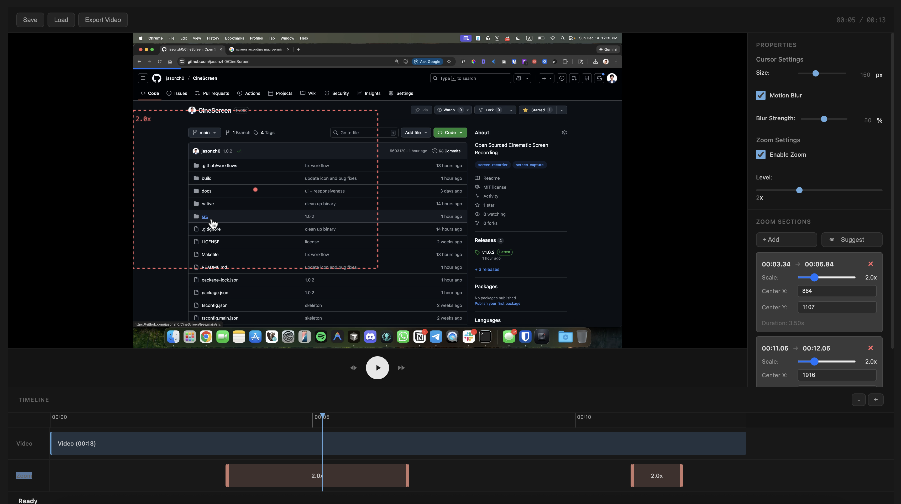

# CineScreen


<div align="center">
  
</div>

A professional macOS screen recording application built with Electron that records your screen without the native cursor, tracks mouse movements separately, and provides a powerful post-processing studio for creating polished, cinematic screen recordings.

### Demo

https://github.com/user-attachments/assets/ffb7723b-470c-4b2f-8bac-63debe614982

### Studio




## Supported Platforms

Currently, CineScreen only supports:
- **macOS ARM64** (Apple Silicon) - M1, M2, M3, and later

Support for Intel Macs (x64) and other platforms may be added in the future.

## Features

### Recording
- **Native cursor-free recording** - Records screen without the system cursor for clean footage
- **Separate mouse tracking** - Tracks mouse movements independently with high precision
- **Region recording** - Record specific screen regions
- **Configurable quality** - Choose from low, medium, or high quality settings
- **Custom frame rates** - Adjustable recording frame rate
- **MKV format** - Uses Matroska format for reliable interrupted recordings

### Studio Editor
- **Real-time preview** - See your changes instantly before rendering
- **Timeline editing** - Navigate through your recording with frame-accurate controls
- **Keyframe support** - Add and edit cursor keyframes for precise control
- **Metadata export** - Export recording metadata for external processing

### Cursor Customization
- **Size control** - Adjustable cursor size (10-200px)
- **Multiple shapes** - Choose from arrow, pointer, hand, crosshair, and more
- **Color customization** - Full color picker for cursor styling
- **Glide effect** - Smooth cursor gliding with critically damped spring physics
- **Directional motion blur** - Cinematic motion blur in the direction of cursor movement
- **Animation styles** - Preset styles: slow, mellow, quick, or rapid
- **Frame offset** - Fine-tune cursor timing synchronization
- **Static cursor hiding** - Automatically hide cursor when not moving
- **Click animations** - Visual feedback on mouse clicks with smooth scaling

### Zoom & Focus Effects
- **Smart zoom** - Automatic zoom tracking that follows your cursor
- **Zoom levels** - Adjustable zoom from 1.5x to 3.0x
- **Smooth transitions** - Physics-based zoom animations with spring dynamics
- **Dead zone** - Prevents jitter when cursor barely moves
- **Auto-zoom on clicks** - Automatically zoom in on click actions
- **Motion blur** - Apply motion blur to zoom/pan movements
- **Advanced physics** - Fine-tune tension, friction, and mass for perfect feel

### Post-Processing
- **High-quality rendering** - Uses Sharp for pixel-perfect frame processing
- **FFmpeg integration** - Professional video encoding with H.264
- **Click detection** - Automatic click event detection and visualization
- **Smooth interpolation** - Critically damped spring physics for smooth cursor and zoom motion
- **Effects system** - Easing functions (linear, easeIn, easeOut, easeInOut) and animation effects
- **Consistent preview/export** - Same rendering logic for preview and final export

## Technology Stack

- **Electron** - Cross-platform desktop framework
- **TypeScript** - Type-safe development
- **FFmpeg** - Video encoding and processing
- **Sharp** - High-performance image processing
- **Vite** - Fast build tool for renderer process
- **Native Swift** - Mouse button state tracking

## Installation

### Download from GitHub Releases

1. Go to the [Releases page](https://github.com/jasonzh0/CineScreen/releases) on GitHub
2. Download the latest `.dmg` file from the assets section
3. Open the downloaded DMG file
4. Drag CineScreen to your Applications folder
5. Launch CineScreen from Applications

**Note:** On first launch, macOS may warn you that the app is from an unidentified developer. To allow it:
- Right-click (or Control-click) the app and select "Open"
- Click "Open" in the security dialog
- Or go to System Settings > Privacy & Security and click "Open Anyway" next to the warning message

## Development

```bash
# Run in development mode (with hot reload)
npm run dev

# Build all components
npm run build

# Start the built application
npm run start

# Package for macOS (creates DMG and ZIP)
npm run package:mac

# Clean build artifacts
npm run clean
```

### Development Scripts

- `npm run dev` - Start development with hot reload for main, preload, and renderer
- `npm run build` - Build all TypeScript and native components
- `npm run build:native` - Build Swift native module
- `npm run start` - Run the built Electron app
- `npm run package:mac` - Create distributable macOS package

## Usage

1. **Grant Permissions** - On first launch, grant Screen Recording and Accessibility permissions
2. **Configure Output** - Set your desired output path for recordings
3. **Start Recording** - Click "Start Recording" to begin capturing
4. **Stop Recording** - Click "Stop Recording" when finished
5. **Open Studio** - Use the Studio editor to customize cursor, zoom, and effects
6. **Render** - Export your final video with all post-processing applied

## Permissions

CineScreen requires the following macOS permissions:

- **Screen Recording** - Required to capture screen content
- **Accessibility** - Required for precise mouse movement tracking

These permissions are requested automatically on first launch. You can also grant them manually in System Settings > Privacy & Security.

## Requirements

- macOS 10.15 (Catalina) or later
- Screen Recording permission
- Accessibility permission

## License

This project is licensed under the MIT License - see the [LICENSE](LICENSE) file for details.

## Contributing

Contributions are welcome! Please feel free to submit a Pull Request.

